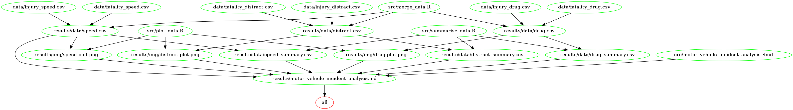

# BC Motor Vehicle Incident Analysis

### Reproduction using Docker

Asssociated with this project is a docker image that contains all software/packages  
necessary to reproduce the results. If you have docker installed and have `git clone`d
this repository, you can run the following command to run the analysis from
beginning to end (you will need only change the local path
  `<local-path-to-project-repository>`
to point to the location of the project repo on your local machine):

```
docker run --rm -v <local-path-to-project-repository>/BC-motor-vehicle-incidents:/home/BC-motor-vehicle-incidents bradleypick/bc-motor-vehicle-incidents make -C '/home/BC-motor-vehicle-incidents'
```

Similarly, you can use the docker image to remove the results with the following
command:

```
docker run --rm -v <local-path-to-project-repository>/BC-motor-vehicle-incidents:/home/BC-motor-vehicle-incidents bradleypick/bc-motor-vehicle-incidents make -C '/home/BC-motor-vehicle-incidents' clean
```

**Note**: other options for running the analysis are listed at the end of the
README.

**Note**: The docker image being used in the above command is located [here](https://hub.docker.com/r/bradleypick/bc-motor-vehicle-incidents/).

### Makefile dependency graph

The `Makefile` dependency graph looks like this:




### Dependencies

The project was developed using

```
R version 3.4.2
Rstudio version 1.1.383
Platform: x86_64-pc-linux-gnu (64-bit)
Running under: Ubuntu 14.04.3 LTS
GNU Make 3.81
Docker version 17.05.0-ce
```

Every effort has been made to use `packrat` to manage package dependencies. As far
as I can tell, this means you should only need to have packrat installed. Until
we learn more about package management I have also included a list of packages explicitly loaded during the analysis and the versions used (as identified by `sessionInfo()`):

- `readr` v 1.1.1
- `tidyr` v 0.7.2
- `stringr` v 1.2.0
- `dplyr` v 0.7.4
- `ggplot2` v 2.2.1
- `cowplot` v 0.9.1
- `ezknitr` v 0.6
- `packrat` v 0.4.8-1
- `knitr` v 1.17

### Identify Dataset

This project accesses data from the Government of British Columbia
[catalogue](https://catalogue.data.gov.bc.ca/dataset).

In particular we download and analyze 8 datasets that all involve fatalities
or injuries sustained in a motor vehicle incident. These datasets include information on [injuries](https://catalogue.data.gov.bc.ca/dataset/motor-vehicle-serious-injuries-with-distraction-involvement) and [fatalities](https://catalogue.data.gov.bc.ca/dataset/motor-vehicle-fatalities-with-distraction-involvement) where distraction was involved, [injuries](https://catalogue.data.gov.bc.ca/dataset/motor-vehicle-serious-injuries-with-speeding-involvement) and [fatalities](https://catalogue.data.gov.bc.ca/dataset/motor-vehicle-fatalities-with-speeding-involvement) where speeding was involved, as well as [injuries](https://catalogue.data.gov.bc.ca/dataset/motor-vehicle-serious-injuries-with-alcohol-and-or-drug-involvement) and [fatalities](https://catalogue.data.gov.bc.ca/dataset/motor-vehicle-fatalities-with-alcohol-and-or-drug-involvement) where drugs or alcohol were involved.

### Question

The objectives of this analysis include investigating the following questions:

- Has the number of fatalities and/or injuries sustained in motor vehicle
incidents in BC increased or decreased in the last decade?

- Has the trend (if present) been driven by any of the factors we have access
to in the data?

### Hypotheses

The objectives of this analysis include investigating the following hypotheses
about the above questions:

- We posit that the number of injuries/fatalities resulting from motor vehicle
incidents has declined over tha last decade.

- We posit the downward trend is caused by drop in all causes *except*
distracted driving.

We investigate this using data on fatalities/injuries involving
drugs and alcohol, speeding, and distracted driving.

### Results

The results confirm both of our hypotheses. Both the total number of injuries and fatalities sustained in motor vehicle incidents in British Columbia dropped between 2004 and 2015.

Furthermore, we found that both speeding and drugs/alcohol have become less frequently occuring factors in these incidents (as measured by sheer numbers).

Finally, we found that the number of injuries and fatalities where distraction was involved actually *increased* between 2004 and 2014.

#### Using Make

If you have make installed and all dependencies on your local machine, you can
simply execute the following command from root of project:

```
make all
```
To clean up:
```
make clean
```


#### Explicit Terminal Commands

The terminal commands that are executed in the Makefile are as follows.

The `src/download_data.R` file takes a url and file location and downloads the file and writes it to the provided location.
The following six commands download the raw data used in the analysis:

```
Rscript src/download_data.R "https://catalogue.data.gov.bc.ca/dataset/bf653fa6-4651-416b-8991-045fb8a3da49/resource/18d1772b-3596-490b-9079-7ef4f565a8c3/download/motor-vehicle-fatalities-with-distraction-involvement.csv" ./data/fatality_distract.csv


Rscript src/download_data.R "https://catalogue.data.gov.bc.ca/dataset/23937c1c-f1e0-497c-a34f-c2c6ce15e775/resource/de1b175c-2725-403a-ba33-6b57f868f38e/download/motor-vehicle-fatalities-with-speeding-involvement.csv" ./data/fatality_speed.csv


Rscript src/download_data.R "https://catalogue.data.gov.bc.ca/dataset/459c4ded-4687-485e-aa10-f957fabefdd1/resource/b7d71c80-81d3-4c6f-a913-9d68f3c49d8e/download/motor-vehicle-fatalities-with-alcohol-and-or-drug-involvement.csv" ./data/fatality_drug.csv


Rscript src/download_data.R "https://catalogue.data.gov.bc.ca/dataset/91d4f3e3-3c16-4f22-bb09-aafd0350659f/resource/00039030-21fb-4441-986c-03cb35d2f852/download/motor-vehicle-serious-injuries-with-distraction-involvement.csv" ./data/injury_distract.csv


Rscript src/download_data.R "https://catalogue.data.gov.bc.ca/dataset/eb4e998f-3d1b-4257-a591-91e863344f0d/resource/9036364a-bce3-4d11-8ff2-a640ff533df6/download/motor-vehicle-serious-injuries-with-speeding-involvement.csv" ./data/injury_speed.csv


Rscript src/download_data.R "https://catalogue.data.gov.bc.ca/dataset/e87b3585-c195-4ee4-b531-a919262816ce/resource/28076ae1-0db2-48c3-a750-75498fe0357f/download/motor-vehicle-serious-injuries-with-alcohol-and-or-drug-involvement.csv" ./data/injury_drug.csv
```
The `src/merge_data.R` script takes two datasets that share a factor of interest and merges the dataframe. It also writes the combined file to the location provided by the user.
The following three commands each merge two datasets based on causal factor of the incidents:

```
Rscript src/merge_data.R data/injury_distract.csv data/fatality_distract.csv ./results/data/distract.csv


Rscript src/merge_data.R data/injury_speed.csv data/fatality_speed.csv ./results/data/speed.csv


Rscript src/merge_data.R data/injury_drug.csv data/fatality_drug.csv ./results/data/drug.csv
```
The `src/plot_data.R` file takes a dataset and produces a figure which is saved to the locaton provided.
The following three commands each take a merged dataset and produce a plot to be used in the report:

```
Rscript src/plot_data.R results/data/distract.csv ./results/img/distract-plot.png


Rscript src/plot_data.R results/data/speed.csv ./results/img/speed-plot.png


Rscript src/plot_data.R results/data/drug.csv ./results/img/drug-plot.png
```
The `src/summarise_data.R` file takes a merged data set and returns a table of summary stats for the final report.
The following commands create summary tables from the merged data sets:
```
Rscript src/summarise_data.R results/data/distract.csv results/data/distract_summary.csv

Rscript src/summarise_data.R results/data/speed.csv results/data/speed_summary.csv

Rscript src/summarise_data.R results/data/drug.csv results/data/drug_summary.csv
```


The following command renders the final report whose raw outline lives in the `src/motor_vehicle_incident_analysis.Rmd` file:

```
Rscript -e 'ezknitr::ezknit("src/motor_vehicle_incident_analysis.Rmd", out_dir = "doc")'
```
